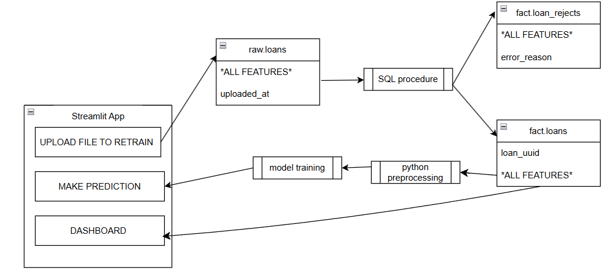

# 🚀 Loan Default Prediction — End-to-End ML System (SQL → ELT → ML → Streamlit + Docker)

An **end-to-end Loan Default Prediction System** that automates data ingestion, ELT, model training, and interactive analytics — all deployed via **Docker**.

---

## 🌟 Overview

This project demonstrates how **Data Engineering + Machine Learning + MLOps** come together in a production-style workflow. It handles everything — from CSV uploads and database ELT, to retraining ML models and visualizing predictions in a Streamlit dashboard.

**Core Stack:** Python (pandas, scikit-learn, imblearn, plotly, streamlit), PostgreSQL, Docker & Docker Compose, SQL stored procedures, environment variables via `.env`.



---

## ⚙️ Quick Start — Run Locally (Dockerized)

> The preferred way to run everything (Postgres + Streamlit + ELT) is via Docker Compose.

```bash
# 1️⃣ Clone the repo
git clone https://github.com/mr-murzo/credit-risk-model.git

# 2️⃣ Navigate into project
cd credit-risk-model

# 3️⃣ Set file permissions (for init scripts)
chmod -R 755 ./initdb

# 4️⃣ Start the full stack
docker compose up -d --build

# 5️⃣ Visit Streamlit app
http://localhost:8501
```

**Notes:**

* The `initdb` folder contains SQL scripts that initialize schemas (`raw`, `fact`, `etl_log`, `loans_rejects`) and any seed data.
* Environment variables are read from a `.env` file in the project root (see below).

---

## 🚀 Running Locally Without Docker (Manual)

### Prerequisites

* Python 3.11 (or compatible)
* PostgreSQL 15

### Steps

1. **Install PostgreSQL** (example):

```bash
# macOS (Homebrew)
brew install postgresql@15
brew services start postgresql@15

# Ubuntu/Debian
sudo apt update
sudo apt install postgresql-15 postgresql-client-15
sudo systemctl start postgresql
```

2. **Create database and user**

```sql
-- Connect to psql and run:
CREATE DATABASE credit_risk_db;
CREATE USER credit_user WITH PASSWORD 'your_password';
GRANT ALL PRIVILEGES ON DATABASE credit_risk_db TO credit_user;
```

3. **Create .env file** (project root)

```
POSTGRES_USER=credit_user
POSTGRES_PASSWORD=your_password
POSTGRES_DB=credit_risk_db
POSTGRES_HOSTNAME=localhost
POSTGRES_PORT=5432
UPLOAD_PASSWORD=admin123
```

4. **Install Python dependencies**

```bash
python3.11 -m venv venv
source venv/bin/activate  # Windows: venv\Scripts\activate
pip install -r requirements.txt
```

5. **Initialize database schema**

```bash
psql -h localhost -U credit_user -d credit_risk_db -f initdb/01_init.sql
```

6. **Run Streamlit app**

```bash
streamlit run app.py --server.enableCORS false --server.enableXsrfProtection false
```

Visit `http://localhost:8501`.

---

## 🗄️ Backend & Database (PostgreSQL)

The backend layer of this project is powered by PostgreSQL and serves as the single source of truth for all raw, cleaned, and processed data. It is structured for data integrity, traceability, and idempotent ELT operations.

⚙️ Database Architecture

Schemas:

raw → stores unvalidated uploads from Streamlit

fact → stores cleaned and validated records used for ML

raw.etl_log → audit table that records each ETL run, including counts of successful and rejected rows

fact.loans_rejects → stores rejected rows with error_reason for debugging


Tables Overview:

Table	Purpose

raw.loans	Direct ingestion from user uploads (all columns stored as text)
fact.loans	Cleaned and strongly typed data for ML & analytics
raw.etl_log	ETL process metadata (timestamps, success/reject counts)
fact.loans_rejects	Invalid rows with detailed error messages


Materialized View:

vw_ml_loan
→ Combines data from fact.loans into a flattened, analysis-ready dataset for ML pipelines and dashboard visualizations.

---

🧩 ELT Process Overview

The ELT is safe, repeatable, and auditable — implemented as a SQL stored procedure and invoked from the Streamlit app.

Key Features

1. Idempotent Loads
Only new rows (based on uploaded_at > last_run_time) are processed to avoid duplication.

SELECT * FROM raw.loans
WHERE (v_last_run IS NULL OR uploaded_at > v_last_run);


2. Duplicate Handling
Deduplication inside each batch using DISTINCT ON (...), ensuring only unique rows are promoted to the fact layer.


3. Validation & Reject Logging
Rows failing validation rules are logged to fact.loans_rejects with descriptive error messages.

Example:

CASE 
  WHEN credit_score NOT BETWEEN 300 AND 850 THEN 'Invalid credit score'
  WHEN person_age !~ '^[0-9]+$' THEN 'Non-numeric age'
  ELSE NULL
END AS error_reason


4. ELT Audit Logging
Every ETL run inserts a record into raw.etl_log capturing:

Timestamp

Success count

Reject count

Execution status

---

## 🧠 Machine Learning Pipeline

**Models:** Logistic Regression, Random Forest

**Preprocessing:**

* Age bucketing (e.g., YOUNG, MIDDLE-AGE, OLD, VERY-OLD)
* Employment experience bucketed into year bins
* DTI (loan_percent_income) bucketed into leverage slabs
* Log transform for skewed features (income, loan_amount)
* `ColumnTransformer` for scaling + one-hot encoding
* **SMOTE** to balance classes when training

**Training flow:**

1. Pull cleaned `fact.loans` from Postgres
2. Apply feature engineering & preprocessing
3. Resample (SMOTE) on training set
4. Fit model(s), evaluate, persist best model artifacts

---

## 💻 Streamlit App

**Pages:**

1. **Upload Data** — password-protected endpoint that inserts raw CSVs, triggers ELT, and retrains models.
2. **Make Predictions** — choose model, enter borrower details, get prediction + probabilities.
3. **Dashboard** — KPIs and visuals (total loans, defaults, default rate, breakdowns by age/education/DTI).

**UI flow:** Upload → ELT → Retrain → Predict → Analyze

---

## 📂 Sample Datasets

* `sample_data folder contains 4 valid sample data and 1 sample with invalid data

---

## 🧪 Development & Tests

* Ensure `.env` variables are set before running.
* Use `initdb` SQL scripts when resetting the DB.
* If you need a fresh DB state, drop the DB and re-run `initdb` scripts (or remove docker volume when using Docker).

---

## 🤝 Contributing

Pull requests are welcome. Please:

1. Open an issue describing the change
2. Create a feature branch
3. Submit a PR with tests and documentation

---
